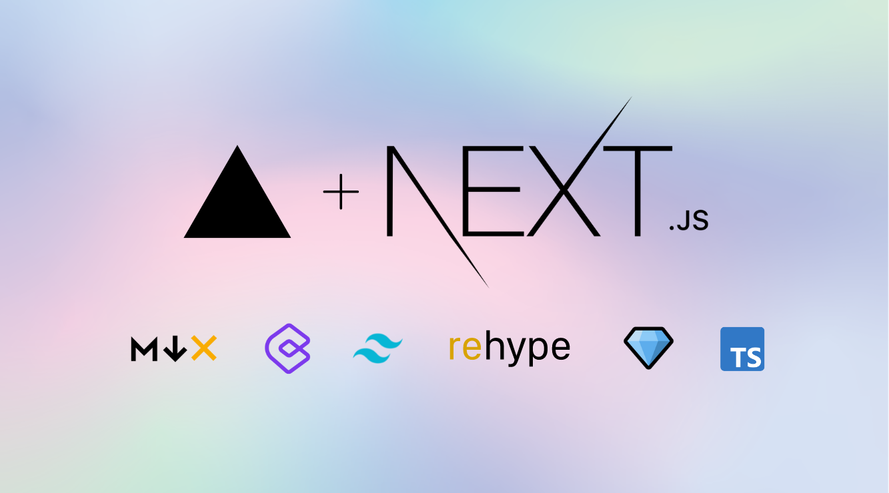

## mobin.me

    

This is the source code of my personal website [mobin.me](https://mobinx.vercel.app). This academic portfolio website is a comprehensive and visually appealing online presence that showcases my skills, achievements, and experiences in my field of study. I built the website using [Next.js](https://nextjs.org/), a highly popular JavaScript framework that allows for the creation of server-rendered and statically generated web applications. To ensure a modern and professional design, I utilized [Tailwind CSS](https://tailwindcss.com/), a utility-first CSS framework, and was inspired by the [Spotlight](https://spotlight.tailwindui.com/) theme from Tailwind UI. The content of my website is managed with the help of [Contentlayer](https://www.contentlayer.dev/), a platform that simplifies the creation and management of content, and is written in Markdown for efficient organization and formatting. The blog posts on my website feature a commenting system powered by [Giscus](https://giscus.app/), a GitHub-based discussion platform, allowing for interactive communication and feedback from my audience. Additionally, I integrated the [Spotify](https://www.spotify.com/) Web API to showcase my recently played songs on the website and used icons from [Heroicons](https://heroicons.com/) to enhance the visual appeal of my website. My website is hosted on [Vercel](https://vercel.com/), a reliable cloud platform for hosting static sites and serverless functions, ensuring smooth and fast access for all users. Overall, I believe my academic portfolio website demonstrates my dedication to staying up-to-date with modern technologies and presents a dynamic and visually striking online presence.

In short, the tech stack of the website is as follows:

- Framework: [Next.js](https://nextjs.org/)
- Styling: [Tailwind CSS](https://tailwindcss.com/)
- Icons: [Heroicons](https://heroicons.com/)
- Content: [Markdown](https://www.markdownguide.org/)
- Content Management: [Contentlayer](https://www.contentlayer.dev/)
- Deployment: [Vercel](https://vercel.com/)
- Comments: [giscus](https://giscus.app/)

## Overview

- `app/*`: I have used next.js new `app` directory structure. This directory contains the main app.
- `components/*`: All custom components are stored in this directory.
- `content/*`: This directory contains all the [Contentlayer](https://contentlayer.dev/) contents.
- `public/*`: This directory contains all the static assets of the website.
- `public/content/*`: This directory contains all the static contents of the website. e.g. projects, experiences, education, etc.
- `styles/*`: I have used Tailwind CSS for styling. This directory contains the Tailwind CSS global styles and some custom styles for the website.
- `utils/*`: This directory contains some utility functions.

## Cloning and Forking

If you want to clone or fork this repository, please make sure to remove the `content` and `public` directories as they contain my personal content and assets. You can add your own content and assets in the `content` and `public` directories respectively.

Clone the repository by running the following command.

```bash
git clone https://github.com/mobinx/mobin.me.git
# or
git clone git@github.com:mobinx/mobin.me.git
```

You can remove the `content` and `public` directories by running the following commands.

```bash
rm -rf content
rm -rf public
```

Add your own content and assets in the `content` and `public` directories respectively.

## Installation

Install the dependencies by running the following command.

```bash
npm install
# or
yarn install
```

Finally, run the following command to start the development server.

```bash
npm run dev
# or
yarn dev
```

Open [http://localhost:3000](http://localhost:3000) with your browser to see the result.

**Note**: You have to create a `.env` file in the root directory and add the following environment variables to get the Spotify integration working.

```bash
SPOTIFY_CLIENT_ID=yourspotifyclientid
SPOTIFY_CLIENT_SECRET=yourspotifyclientsecret
SPOTIFY_REFRESH_TOKEN=yourspotifyrefreshtoken
```

You can get the `SPOTIFY_CLIENT_ID` and `SPOTIFY_CLIENT_SECRET` from [Spotify Developer Dashboard](https://developer.spotify.com/dashboard/). You can get the `SPOTIFY_REFRESH_TOKEN` from [Spotify Web API Console](https://developer.spotify.com/console/get-recently-played/).

## Inspiration

I have used the following websites as inspiration for building this website.

- [Delba - delba.dev](https://delba.dev/)
- [Lee Robinson - leerob.io](https://leerob.io/)
- [Manu Arora - manuarora.in](https://manuarora.in/)
- [Tailwind Nextjs Starter Blog](https://github.com/timlrx/tailwind-nextjs-starter-blog)

The styles of the website are inspired by the [Spotlight](https://spotlight.tailwindui.com/) theme design by [Tailwind UI](https://tailwindui.com/).
